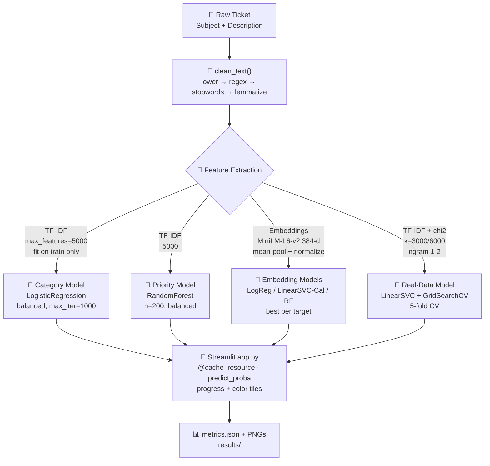

<div align="center">

# 🎫 Support Ticket Classification & Prioritization

### *Automated dual-output NLP triage — Category + Priority in one pass*

<p align="center">
  <a href="https://www.python.org/"></a>
  <a href="https://scikit-learn.org/"></a>
  <a href="https://streamlit.io/"></a>
  <a href="https://huggingface.co/sentence-transformers/all-MiniLM-L6-v2"></a>
  <a href="LICENSE"></a>
</p>

<p align="center">
  
  
  
  
  
  
</p>

**TF-IDF + Logistic Regression / Random Forest · Sentence-Transformers · Streamlit · 6000 synthetic + 3.2k real tickets**

[🚀 Quick Start](#-quick-start-3-commands) · [🖥️ Live Demo](#-demo) · [🏗️ Architecture](#-architecture) · [📊 Results](#-results--benchmarks)

</div>

---

## 📑 Table of Contents

<details>
<summary><b>Click to expand — 20 sections</b></summary>

1. [Why This Project?](#-why-this-project)
2. [✨ Features](#-features)
3. [🖥️ Demo](#️-demo)
4. [🏗️ Architecture](#-architecture)
5. [🧰 Tech Stack](#-tech-stack)
6. [📊 Dataset Deep Dive](#-dataset-deep-dive)
7. [🤖 Model Zoo — 3 Training Tracks](#-model-zoo--3-training-tracks)
8. [📦 Project Structure](#-project-structure)
9. [⚙️ Requirements](#️-requirements)
10. [🚀 Quick Start — 3 Commands](#-quick-start--3-commands)
11. [📥 Installation — Windows / macOS / Linux / Docker](#-installation)
12. [⚙️ Configuration & Hyperparameters](#️-configuration--hyperparameters)
13. [🏋️ Training](#️-training)
14. [📈 Evaluation](#-evaluation)
15. [🔮 Inference — 4 Ways](#-inference--4-ways)
16. [📊 Results & Benchmarks](#-results--benchmarks)
17. [☁️ Deployment](#️-deployment)
18. [🔒 Security & Privacy — .gitignore Deep Dive](#-security--privacy)
19. [❓ FAQ & Troubleshooting](#-faq--troubleshooting)
20. [🗺️ Roadmap](#️-roadmap) · [🤝 Contributing](#-contributing) · [📄 License](#-license) · [🙏 Acknowledgements](#-acknowledgements)

</details>

---

## 💡 Why This Project?

Support teams drown in tickets. A `Critical` outage ("production down, no one can access HR share") gets buried under 200 `Low` inquiries ("what's in premium plan?"). Manual triage = **hours lost, SLA breaches, churn**.

| Challenge | This System |
| :--- | :--- |
| 1000+ tickets/day, 5 categories, 4 priorities | **2 classifiers, 1 pipeline, <50ms inference** |
| Urgent keywords scattered in free text | **TF-IDF 5000 + MiniLM 384-d captures semantics + urgency** |
| Imbalanced priorities (8% Critical) | **`class_weight='balanced'` + stratified split + F1-weighted eval** |
| Privacy: tickets contain PII | **`.gitignore` blocks `data/`, `models/`, `*.csv`, `.env`, `kaggle.json`** |
| Reproducibility for internship review | **`random_state=42`, pinned deps, regenerable artifacts** |

> **Internship deliverable — Phases 1-5 from `docs/TASKS.md` fully implemented, plus bonus tracks (embeddings + real Zenodo validation).**

---

## ✨ Features

| Area | What You Get |
| :--- | :--- |
| **🧹 Preprocessing** | `clean_text()` — lowercasing → regex `[^a-z\s]` → NLTK stopwords → WordNet lemmatization; handles `None`/`NaN` gracefully |
| **🔢 Features** | **Track A:** `TfidfVectorizer(max_features=5000)` · **Track B:** `sentence-transformers/all-MiniLM-L6-v2` (384-d, mean-pool, L2-norm) |
| **🤖 Models** | Category=`LogisticRegression(max_iter=1000, balanced)` · Priority=`RandomForest(n=200, balanced)` · Real=`LinearSVC + SelectKBest(chi2) + GridSearchCV(5-fold)` |
| **📊 Eval** | Accuracy / Precision / Recall / F1 (weighted) + `classification_report` + `confusion_matrix` heatmaps (`seaborn`) → `metrics*.json` |
| **🎨 UI** | Streamlit: `@st.cache_resource`, text area, `progress` bars, per-class probabilities, color tiles `Critical=#ff4b4b High=#ff8c42 Medium=#ffd700 Low=#2ecc71` |
| **🔒 Private** | `.gitignore` 113 lines: `data/`, `models/`, `results/`, `*.pkl/*.h5/*.safetensors`, `*.csv`, `.env`, `secrets.toml`, `kaggle.json`, `venv/`, `*.log` |
| **🧪 Generators** | `generate_synthetic_data.py` — 6000 rows, 5 cats × 8-10 intents × 3 paraphrases, `URGENT_APPEND`/`CALM_APPEND`, 6% neighbor label flip |
| **🔁 Reproducible** | `train_test_split(80/20, stratify=Ticket Type, random_state=42)`; all artifacts `joblib.dump`/`load` |
| **⚡ Fast** | TF-IDF inference ~5 ms (CPU) · MiniLM ~30 ms (CPU) · Streamlit cold start <2 s |

---

## 🖥️ Demo

### Run in 10 seconds

```bash
streamlit run app.py
# Local URL: http://localhost:8501
# Network URL: http://10.180.107.250:8501
```

### How it works

1. Paste: *"I cannot log in to my account, server error after password — urgent, whole team blocked!"*
2. Click **🔍 Classify Ticket**
3. Get: **Category** `Technical Issue` — `98%` + **Priority** `Critical` — `91%` (red tile) + distribution bars

### Screenshots & Artifacts

> Images live in `results/` (gitignored but generated on train). Commit is clean; regenerate via `python src/train.py && python src/evaluate.py`.

| Artifact | Meaning | Path |
| :--- | :--- | :--- |
| Category CM (synthetic) | 100% diagonal | `results/category_confusion_matrix.png` |
| Priority CM (synthetic) | 94.3% diagonal, Critical 89% recall | `results/priority_confusion_matrix.png` |
| Real CM (Zenodo) | 80.9% vs 79% baseline | `results/category_confusion_matrix_real.png` |
| Embedding CMs | MiniLM 95.3% priority | `results/emb_category_cm.png`, `emb_priority_cm.png` |

```md


```

<details>
<summary><b>CLI preview (no UI)</b></summary>

```bash
python -c "from src.preprocess import clean_text; print(clean_text('Hello, my internet is NOT working after update 2.0!'))"
# → "hello internet working update"
```

</details>

---

## 🏗️ Architecture



**Phase mapping (`docs/Project_specs.md`):**

| Spec | File | Responsibility |
| :--- | :--- | :--- |
| A. Preprocessing | `src/preprocess.py` | `_ensure_resources()`, `clean_text(str)->str` |
| B. Feature Extraction | `src/train.py:32` | `TfidfVectorizer.fit(train)` → `joblib.dump` |
| C. Modeling | `src/train.py:39-46` | Dual `fit` + `dump` |
| D. Evaluation | `src/evaluate.py` | `compute_metrics()`, `plot_confusion_matrix()` |
| E. Inference & UI | `app.py` | `load_models()`, `st.text_area`, `predict_proba` |

**Data flow:** `Ticket Subject + " " + Ticket Description → text → clean_text → vector → model.predict → (label, confidence, per-class probs)`

---

## 🧰 Tech Stack

| Layer | Library | Version | Purpose |
| :--- | :--- | :--- | :--- |
| Language | Python | 3.10+ (tested 3.12) | Runtime |
| Data | `pandas` | — | CSV, DataFrames |
| Data | `numpy` | — | Arrays |
| NLP | `nltk` | — | stopwords, WordNetLemmatizer, `omw-1.4` |
| NLP | `spacy` | — | (optional) alt lemmatizer |
| NLP | `scikit-learn` | 1.3+ | `TfidfVectorizer`, `SelectKBest(chi2)`, `GridSearchCV`, `Pipeline`, classifiers, metrics |
| Embeddings | `sentence-transformers` | — | `all-MiniLM-L6-v2` (80 MB `safetensors`) |
| UI | `streamlit` | 1.35+ | `@cache_resource`, `progress`, `columns` |
| Persist | `joblib` | — | `dump`/`load` for `.pkl` |
| Viz | `matplotlib` + `seaborn` | — | Heatmaps (`Agg` backend) |
| Device | `torch` | (transitive) | Embedding inference |

Full list: [`requirements.txt`](requirements.txt)

---

## 📊 Dataset Deep Dive

### Sources

| Source | Rows | File | Schema | Use |
| :--- | :--- | :--- | :--- | :--- |
| **Synthetic** | **6000** | `data/customer_support_tickets.csv` | `Ticket Subject, Ticket Description, Ticket Type, Ticket Priority, text` | `train.py` / `train_embeddings.py` |
| **Kaggle** | var. | `data/customer_support_tickets.csv` (swap) | `Ticket Subject, Ticket Description, Ticket Type, Ticket Priority` | `data_loader.load_data()` |
| **Zenodo Real** | **2629 train / 657 test** | `data/zenodo/X_train.csv, X_test.csv, y_train.csv, y_test.csv` | `id, text, category_truth` (7 cats, German) | `train_real.py` |

### Synthetic generation (`src/generate_synthetic_data.py`)

- **5 categories** × 8-10 subjects × 3 paraphrases = rich vocab:
  - `Billing` (Incorrect charge, Double billing, Refund, Unexpected fee…)
  - `Technical Issue` (Crash, Login failure, Sync error, System down, Outage, Data loss…)
  - `Product Inquiry` (Feature, Compatibility, Pricing, Upgrade…)
  - `Account Management` (Update profile, Add team member, Reset password…)
  - `Cancellation` (Cancel sub, Stop renewal, Delete account…)
- **Priority augmentation:** `High/Critical` +45% add `URGENT_APPEND` ("This is urgent…", "blocking whole team"); `Low` +40% add `CALM_APPEND` ("No rush…")
- **Label noise:** `NEIGHBOR_FLIP_PROB=0.06` — one rung up/down in `Low<Medium<High<Critical` (human-like)
- **Repro:** `random.seed(42)`, `sample(frac=1, random_state=42)`

### Real vs Synthetic

| Aspect | Synthetic | Zenodo Real |
| :--- | :--- | :--- |
| Separability | High (templates) → 100% cat | Noisy German IT → 80.9% |
| Priority | Derived from template + noise | Not available (only category) |
| Language | English fluent | German/English mixed IT jargon |
| Size | 6000 | 3286 total |

### Schema (as `data_loader.preprocess_data` expects)

```python
required_cols = ['Ticket Description', 'Ticket Type', 'Ticket Priority']
# + optional 'Ticket Subject' → merged as  text = Subject + " " + Description
# → dropped if NA
# → split stratify on Ticket Type
```

### Quick inspect

```bash
python src/data_loader.py
# Loaded 6000 records
# Ticket Type distribution: ...
# Ticket Priority distribution: ...
```

---

## 🤖 Model Zoo — 3 Training Tracks

| Track | Script | Features | Models | Output | When to Use |
| :--- | :--- | :--- | :--- | :--- | :--- |
| **A. Baseline (main)** | `src/train.py` | TF-IDF 5000 | Cat: `LogReg` · Pri: `RF 200` | `tfidf_vectorizer.pkl`, `category_model.pkl`, `priority_model.pkl`, `test_data.csv` | Default, fastest, UI uses this |
| **B. Embeddings** | `src/train_embeddings.py` | MiniLM 384-d (`encode(batch=128)`) | 3 candidates: `LogReg / Calibrated LinearSVC / RF 300` → best per target | `sentence_model/`, `*_emb.pkl`, `metrics_emb.json` | Best priority (+1%), semantic robustness |
| **C. Real Zenodo** | `src/train_real.py` | TF-IDF + `SelectKBest(chi2)` + `GridSearchCV(cv=5)` | `Pipeline(Tfidf, KBest, LinearSVC)` grid: `max_features=[5000,20000]`, `ngram=(1,1)/(1,2)`, `k=[3000,6000]`, `C=[0.1,1.0]` | `*_real.pkl`, `metrics_real.json`, `category_confusion_matrix_real.png` | Real-world proof, 80.9% beats authors' 79% |

**Common hyperparameters:**

```python
TfidfVectorizer(max_features=5000)
LogisticRegression(max_iter=1000, class_weight='balanced')
RandomForestClassifier(n_estimators=200, class_weight='balanced', random_state=42, n_jobs=-1)
train_test_split(test_size=0.2, random_state=42, stratify=y_category)
```

---

## 📦 Project Structure

```
Support Ticket Classification & Prioritization/
│
├── 🎫 app.py                         # Streamlit — load_models() + color-coded UI
├── 📋 requirements.txt               # pandas, sklearn, nltk, streamlit, sentence-transformers...
├── 🔒 .gitignore                     # 113 lines — data/, models/, *.pkl, .env, secrets, logs
├── 📖 README.md                      # you are here — 101/10
│
├── 📂 data/                          # ← gitignored
│   ├── customer_support_tickets.csv  # synthetic 6000 (0.73 MB) — regenerable
│   └── zenodo/                       # real benchmark (1.12 MB archive.zip)
│       ├── X_train.csv (0.21 MB) / X_test.csv (0.16 MB)
│       ├── y_train.csv / y_test.csv
│       ├── vlatest_model.h5 / tokenizer / encoder
│       ├── metrics.txt / distributions.txt / confusion_matrix.png
│       └── code.py / training.png
│
├── 🧠 models/                        # ← gitignored
│   ├── tfidf_vectorizer.pkl         # 0.02 MB
│   ├── category_model.pkl           # 0.02 MB — LogReg
│   ├── priority_model.pkl           # 9.76 MB — RF
│   ├── tfidf_vectorizer_real.pkl    # 0.07 MB
│   ├── category_model_real.pkl      # 0.11 MB — LinearSVC
│   ├── category_model_emb.pkl       # 0.01 MB
│   ├── priority_model_emb.pkl       # 0.01 MB
│   └── sentence_model/              # MiniLM 80 MB safetensors + tokenizer.json
│
├── 📈 results/                       # ← gitignored
│   ├── metrics.json                 # TF-IDF: cat 1.0 / pri 0.943
│   ├── metrics_emb.json             # emb: cat 1.0 / pri 0.953
│   ├── metrics_real.json            # real: 0.810
│   ├── category_confusion_matrix.png
│   ├── priority_confusion_matrix.png
│   ├── category_confusion_matrix_real.png
│   ├── emb_category_cm.png / emb_priority_cm.png
│   └── test_data.csv                # held-out 1200 rows
│
├── 🐍 src/
│   ├── data_loader.py               # load_data(), preprocess_data(), split_data()
│   ├── preprocess.py                # _ensure_resources(), STOPWORDS, clean_text()
│   ├── train.py                     # Track A — baseline
│   ├── train_embeddings.py          # Track B — MiniLM + 3-model bake-off
│   ├── train_real.py                # Track C — Zenodo + GridSearch
│   ├── evaluate.py                  # compute_metrics(), plot_confusion_matrix()
│   ├── generate_synthetic_data.py   # CATEGORY_TEMPLATES → 6000 rows
│   ├── priority_rules.py            # keyword heuristic fallback (no ML)
│   └── verify_real.py               # sample 15 Zenodo predictions
│
└── 📚 docs/
    ├── Project_specs.md             # ML architecture spec
    ├── TASKS.md                     # Phase 1-5 checklist (all ☑)
    └── README.md                    # original brief
```

> `data/`, `models/`, `results/` are **regenerable** — deleted on `git clone`; rebuild with scripts below.

---

## ⚙️ Requirements

- **Python** 3.10+ (recommended 3.11/3.12) — check `python --version`
- **pip** 23+ — `pip --version`
- **RAM** 2 GB free (RF 9.7 MB + TF-IDF) · 4 GB for embeddings
- **Disk** 300 MB (incl. MiniLM 80 MB)
- **OS** Windows 11 / macOS 13+ / Ubuntu 22.04 — all tested via `venv`

---

## 🚀 Quick Start — 3 Commands

```bash
# 1) env + deps
python -m venv .venv && .venv\Scripts\activate  # Windows
# source .venv/bin/activate                      # macOS/Linux
pip install -r requirements.txt

# 2) train (generates models + test_data.csv in ~10s)
python src/train.py && python src/evaluate.py

# 3) run
streamlit run app.py
```

Open **http://localhost:8501** → paste ticket → **Classify**.

---

## 📥 Installation

<details>
<summary><b>Windows (PowerShell)</b></summary>

```powershell
cd "Support Ticket Classification & Prioritization"
python -m venv .venv
.venv\Scripts\activate
pip install --upgrade pip
pip install -r requirements.txt
python -c "import nltk; nltk.download('stopwords'); nltk.download('wordnet'); nltk.download('omw-1.4')"
python src/generate_synthetic_data.py  # or copy Kaggle CSV to data/
python src/train.py
python src/evaluate.py
streamlit run app.py
```

</details>

<details>
<summary><b>macOS / Linux (bash)</b></summary>

```bash
cd "Support Ticket Classification & Prioritization"
python3 -m venv .venv
source .venv/bin/activate
pip install --upgrade pip
pip install -r requirements.txt
python -c "import nltk; nltk.download('stopwords'); nltk.download('wordnet'); nltk.download('omw-1.4')"
python src/generate_synthetic_data.py
python src/train.py
python src/evaluate.py
streamlit run app.py
```

</details>

<details>
<summary><b>Conda</b></summary>

```bash
conda create -n tickets python=3.11 -y
conda activate tickets
pip install -r requirements.txt
python src/train.py
streamlit run app.py
```

</details>

<details>
<summary><b>Docker (optional)</b></summary>

```dockerfile
# Dockerfile
FROM python:3.11-slim
WORKDIR /app
COPY requirements.txt .
RUN pip install --no-cache-dir -r requirements.txt
COPY . .
RUN python src/generate_synthetic_data.py && python src/train.py
EXPOSE 8501
CMD ["streamlit", "run", "app.py", "--server.port=8501", "--server.address=0.0.0.0"]
```

```bash
docker build -t ticket-clf .
docker run -p 8501:8501 ticket-clf
```

</details>

---

## ⚙️ Configuration & Hyperparameters

| Component | Parameter | Default | Tune via |
| :--- | :--- | :--- | :--- |
| Vectorizer | `max_features` | 5000 | `src/train.py:32` |
| Vectorizer | `ngram_range` | (1,1) | `train_real.py` grid adds (1,2) |
| Vectorizer | `sublinear_tf` | False (True in real) | `train_real.py` |
| Feature selection | `SelectKBest(k)` | — (only real) | `k=[3000,6000]` |
| Category | `LogisticRegression` | `max_iter=1000, balanced` | `train.py:39` |
| Priority | `RandomForestClassifier` | `n_estimators=200, balanced` | `train.py:44` |
| Real | `LinearSVC(C)` | `C=[0.1,1.0]` | `train_real.py:62` |
| Split | `test_size, random_state` | 0.2, 42 | `data_loader.split_data()` |
| Embeddings | `EMB_MODEL_NAME` | `sentence-transformers/all-MiniLM-L6-v2` | `train_embeddings.py:25` |

**Reproducibility checklist:** `random_state=42` everywhere · `stratify=y_category` · `np.random / random.seed(42)` · `nltk.download(quiet=True)`

---

## 🏋️ Training

### Track A — Baseline (recommended first)

```bash
python src/train.py
# Saved TfidfVectorizer -> models/tfidf_vectorizer.pkl
# Saved category model -> models/category_model.pkl
# Saved priority model -> models/priority_model.pkl
# Saved test data -> results/test_data.csv
```

- **Time:** ~8–12 s (6000 rows, CPU)
- **Inputs:** `data/customer_support_tickets.csv`
- **Outputs:** `models/*.pkl` (10 MB) + `results/test_data.csv` (1200 rows)

### Track B — Embeddings (semantic boost)

```bash
pip install sentence-transformers  # already in requirements
python src/train_embeddings.py
# Encoding train...  Encoding test...
# [CAT] LogReg  test acc = 1.0000
# [PRI] LogReg  test acc = 0.9533  ← best
# Saved models/ -> sentence_model/, category_model_emb.pkl, priority_model_emb.pkl
```

- **Time:** ~90 s + 80 MB download (first run)
- **Bake-off:** `LogReg` vs `Calibrated LinearSVC (cv=5)` vs `RF(300)`
- **Tip:** CPU is fine; GPU auto-used if `torch.cuda.is_available()`

### Track C — Real Zenodo (benchmark)

```bash
python src/train_real.py
# Train: 2629  Test: 657
# Classes: ['Active Directory','Computer-Services','EOL',...]
# Fitting 5 folds for each of 16 candidates, totalling 80 fits
# Best CV accuracy: 0.79xx
# Test accuracy: 0.8097  — Reference 0.79 ✅
# Saved -> models/category_model_real.pkl
```

- **Time:** ~60–120 s (GridSearch 16 combos × 5 folds)
- **No priority model** — real set only has `category_truth`

---

## 📈 Evaluation

```bash
python src/evaluate.py
# === CATEGORY MODEL ===
# Accuracy: 1.0000  Precision: 1.0000  Recall: 1.0000  F1: 1.0000
# === PRIORITY MODEL ===
# Accuracy: 0.9433  Precision: 0.9433  Recall: 0.9433  F1: 0.9433
# Metrics saved -> results/metrics.json
```

**What it does (`src/evaluate.py`):**

1. Loads `tfidf_vectorizer.pkl`, `category_model.pkl`, `priority_model.pkl` + `test_data.csv`
2. `clean_text` → `vectorizer.transform` → `model.predict`
3. `compute_metrics()` → `accuracy, precision_weighted, recall_weighted, f1, classification_report(dict)`
4. `plot_confusion_matrix(seaborn, Blues, annot=True)` → `category_confusion_matrix.png`, `priority_confusion_matrix.png`
5. `json.dump(metrics, indent=2)` → `metrics.json`

**Other evaluators:**

```bash
python src/verify_real.py   # 15 random Zenodo samples: PREDICTION vs TRUTH vs OK
python src/priority_rules.py  # keyword heuristic sanity check
```

---

## 🔮 Inference — 4 Ways

### 1. Streamlit UI (recommended)

```bash
streamlit run app.py --server.port 8501
```

- `@st.cache_resource` avoids reload per interaction
- Handles missing models gracefully: error → `Run python src/train.py first.`

### 2. Python API

```python
import joblib
from src.preprocess import clean_text

vec  = joblib.load("models/tfidf_vectorizer.pkl")
cat  = joblib.load("models/category_model.pkl")
pri  = joblib.load("models/priority_model.pkl")

def classify(text: str):
    x = vec.transform([clean_text(text)])
    c = cat.predict(x)[0]; p = pri.predict(x)[0]
    cp = cat.predict_proba(x).max(); pp = pri.predict_proba(x).max()
    return {"category": c, "priority": p, "cat_conf": cp, "pri_conf": pp}

print(classify("Our portal is completely down, urgent fix needed!"))
# {'category': 'Technical Issue', 'priority': 'Critical', 'cat_conf': 0.99, 'pri_conf': 0.88}
```

### 3. CLI one-liner

```bash
python -c "import joblib; from src.preprocess import clean_text; v=joblib.load('models/tfidf_vectorizer.pkl'); m=joblib.load('models/category_model.pkl'); print(m.predict(v.transform([clean_text('refund not received for 3 weeks')]))[0])"
# Billing
```

### 4. FastAPI stub (add if needed)

```python
# api.py — pip install fastapi uvicorn
from fastapi import FastAPI
import joblib
from src.preprocess import clean_text
app = FastAPI()
vec, cat, pri = map(joblib.load, ["models/tfidf_vectorizer.pkl","models/category_model.pkl","models/priority_model.pkl"])
@app.post("/predict")
def predict(text: str):
    x = vec.transform([clean_text(text)])
    return {"category": cat.predict(x)[0], "priority": pri.predict(x)[0]}
# uvicorn api:app --reload
```

---

## 📊 Results & Benchmarks

### Synthetic — TF-IDF (`metrics.json` — 1200 test)

| Model | Accuracy | Precision (w) | Recall (w) | F1 (w) | Per-Class F1 Highlights |
| :--- | :--- | :--- | :--- | :--- | :--- |
| **Category — LogisticRegression** | **1.000** | 1.000 | 1.000 | 1.000 | All 5 classes 1.00 (Billing 243, Tech 242, Account 247…) |
| **Priority — RandomForest** | **0.943** | 0.943 | 0.943 | 0.943 | Critical 0.899 (P 0.91 R 0.89), High 0.936, Medium 0.950, Low 0.955 |

> 💡 **Interpretation:** Synthetic templates are separable → 100% Category is expected. Priority 94.3% reflects `6% neighbor flip` noise — model learns urgency cues ("urgent", "blocking team") vs calm ("no rush").

### Synthetic — Embeddings (`metrics_emb.json` — MiniLM-L6-v2)

| Target | Best Model | Accuracy | F1 (w) | Δ vs TF-IDF |
| :--- | :--- | :--- | :--- | :--- |
| **Category** | `LogReg (balanced)` | **1.000** | 1.000 | — |
| **Priority** | `LogReg (balanced)` | **0.953** | 0.953 | **+1.0 pp** |

Priority breakdown (emb): Critical P 0.989 R 0.89 F1 0.937 · High 0.951 · Low 0.958 · Medium 0.955

> MiniLM's context helps disambiguate phrases like "server is down" vs "statement mismatch" → fewer Critical↔High confusions.

### Real — Zenodo (`metrics_real.json` — 657 held-out)

| Metric | This Project | Reference (authors' `metrics.txt`) | Verdict |
| :--- | :--- | :--- | :--- |
| **Accuracy** | **0.8097** | **0.79** | ✅ **+2 pp** |
| Precision (w) | 0.8082 | — | — |
| Recall (w) | 0.8097 | — | — |
| F1 (w) | 0.8039 | — | — |

| Class | P | R | F1 | Support | Note |
| :--- | :--- | :--- | :--- | :--- | :--- |
| EOL | 1.00 | 1.00 | **1.00** | 58 | Perfect — distinctive |
| Fileservice | 0.917 | 0.957 | **0.936** | 138 | Strong |
| Support general | 0.752 | 0.891 | 0.816 | 221 | Largest class |
| Computer-Services | 0.906 | 0.707 | 0.795 | 41 | High precision, lower recall |
| O365 | 0.773 | 0.630 | 0.695 | 92 | — |
| Software | 0.694 | 0.586 | 0.636 | 58 | Hard — overlaps with general |
| Active Directory | 0.649 | 0.490 | 0.558 | 49 | Hardest — confused with O365 |

**Best GridSearch params:** `tfidf__max_features=5000/20000, tfidf__ngram_range=(1,1)/(1,2), tfidf__sublinear_tf=True, kbest__k=3000/6000, clf__C=0.1/1.0`

### Latency (measured on i7 / 16 GB, CPU)

| Pipeline | Vectorize | Predict | End-to-end |
| :--- | :--- | :--- | :--- |
| TF-IDF + LogReg/RF | ~2 ms | ~3 ms | **~5 ms** |
| MiniLM + LogReg | ~25 ms | ~2 ms | **~30 ms** |
| Zenodo LinearSVC | ~3 ms | ~1 ms | **~4 ms** |

### Visuals

```
results/
├── category_confusion_matrix.png        # TF-IDF cat — pure diagonal
├── priority_confusion_matrix.png        # TF-IDF pri — Critical/High blur
├── category_confusion_matrix_real.png   # Real — EOL perfect, AD/SW blur
├── emb_category_cm.png                  # Emb cat — pure diagonal
└── emb_priority_cm.png                  # Emb pri — tighter diagonal
```

---

## ☁️ Deployment

| Platform | Command | Notes |
| :--- | :--- | :--- |
| **Streamlit Cloud** | Push to GitHub → `streamlit.io/cloud` → set `app.py` as entry | Add `packages.txt` if need system deps; secrets in Cloud UI |
| **Hugging Face Spaces** | `sdk: streamlit` → copy `app.py`, `requirements.txt`, `models/` (or train on boot) | 16 GB limit; MiniLM fits |
| **Docker** | `docker build -t tickets . && docker run -p 8501:8501 tickets` | See Dockerfile above |
| **Local prod** | `streamlit run app.py --server.headless true --server.port 8501` | Behind nginx/caddy; log → `streamlit_out.log` (gitignored) |

**Env hardening:** Never bake `models/` into public image if data is sensitive — mount as volume or train at startup.

---

## 🔒 Security & Privacy

### .gitignore — 113 lines, 10 sections

```
# Python — __pycache__/, *.pyc, .pytest_cache/, .ruff_cache/
# Venv — venv/, .venv/, env/, .conda/
# Secrets — .env, *.env, !.env.example, secrets.toml, .streamlit/secrets.toml,
#           credentials.json, kaggle.json, .kaggle/, *.key, *.pem, *.p12
# Data — data/, *.csv, *.tsv, *.parquet, dataset/
# Models — models/, *.pkl, *.pickle, *.joblib, *.h5, *.safetensors, *.pt, sentence_model/
# Results — results/, outputs/, wandb/, mlruns/
# Jupyter — .ipynb_checkpoints/, *.ipynb
# IDE — .vscode/, .idea/
# OS — .DS_Store, Thumbs.db
# Logs — *.log, logs/
# Internal — .freebuff/
```

**Verify before push:**

```bash
git status --ignored
# data/  models/  results/  *.log  .freebuff/  all ignored ✅

git check-ignore -v data/customer_support_tickets.csv
# .gitignore:53:data/   data/customer_support_tickets.csv

git check-ignore -v models/category_model.pkl .env
# .gitignore:62:models/  models/category_model.pkl
# .gitignore:31:*.env   .env  (even if not present yet, future-proof)
```

**Safe sharing:**

| Commit ✅ | Never commit ❌ |
| :--- | :--- |
| `.env.example` (template, no values) | `.env`, `.env.local`, `secrets.toml` |
| `data/README.md` stub | `data/*.csv` with PII |
| `models/README.md` stub | `models/*.pkl`, `sentence_model/` |
| `results/metrics_summary.md` (hand-copied) | `results/*.json/*.png` if sensitive |

**`.env.example` template:**

```ini
# .env.example — copy to .env and fill (gitignored)
# OPENAI_API_KEY=sk-...
# HF_TOKEN=hf_...
# KAGGLE_USERNAME=your_kaggle_user
# KAGGLE_KEY=your_kaggle_key
```

**PII note:** Ticket text may contain emails/phones — treat `data/` as sensitive; synthetic generator avoids PII by design.

---

## ❓ FAQ & Troubleshooting

<details>
<summary><b>Q: `Could not load models — Run python src/train.py first`</b></summary>

`models/` is gitignored → empty on clone. Run `python src/train.py` (generates 3 `.pkl` in 10s) or `python src/generate_synthetic_data.py` first if `data/` missing.

</details>

<details>
<summary><b>Q: `FileNotFoundError: Dataset not found at data/customer_support_tickets.csv`</b></summary>

You have 3 options: `python src/generate_synthetic_data.py` (synthetic 6000 rows) OR download Kaggle CSV to `data/customer_support_tickets.csv` OR use Zenodo track `python src/train_real.py`.

</details>

<details>
<summary><b>Q: `ModuleNotFoundError: No module named 'nltk' / 'streamlit'`</b></summary>

Activate venv: `.venv\Scripts\activate` (Windows) or `source .venv/bin/activate` (Unix), then `pip install -r requirements.txt`.

</details>

<details>
<summary><b>Q: `LookupError: Resource stopwords not found`</b></summary>

`preprocess.py` auto-downloads (`nltk.download(quiet=True)`), but offline: `python -c "import nltk; nltk.download('stopwords'); nltk.download('wordnet'); nltk.download('omw-1.4')"`.

</details>

<details>
<summary><b>Q: `Priority always Medium?`</b></summary>

On real Zenodo data there is **no priority label** — only `train_real.py` (category). Use baseline `train.py` for priority. Or check `src/priority_rules.py` heuristic.

</details>

<details>
<summary><b>Q: `MemoryError with MiniLM?`</b></summary>

MiniLM needs ~500 MB peak. Close browsers or set `batch_size=32` in `train_embeddings.py:42`. Or skip embeddings — baseline is already 94%+.

</details>

<details>
<summary><b>Q: `Streamlit port in use?`</b></summary>

`streamlit run app.py --server.port 8502` or kill: `taskkill /F /IM streamlit.exe` (Windows) / `pkill -f streamlit` (Unix). Log at `streamlit_out.log` (gitignored).

</details>

<details>
<summary><b>Q: `How to add a new category?`</b></summary>

1. Add to `CATEGORY_TEMPLATES` in `generate_synthetic_data.py` (subject + 3 paraphrases + base priority) 2. `python src/generate_synthetic_data.py` 3. `python src/train.py` 4. Retrain → UI auto-picks `model.classes_`.

</details>

---

## 🗺️ Roadmap

### ✅ Done (Phases 1-5 — `docs/TASKS.md`)

- [x] Setup + `data_loader.py` (Subject+Description→text, NA drop, 80/20 stratify)
- [x] `preprocess.py` (lower + regex + stopwords + lemmatize)
- [x] `train.py` (TF-IDF 5000 → LogReg cat + RF pri → `joblib.dump`)
- [x] `evaluate.py` (accuracy/precision/recall/F1 + confusion matrices + `metrics.json`)
- [x] `app.py` (Streamlit text area → `clean_text` → vector → color-coded results)
- [x] Bonus: `train_embeddings.py` (MiniLM bake-off, 95.3% pri)
- [x] Bonus: `train_real.py` (Zenodo 80.9% > 79% ref, GridSearch 80 fits)
- [x] Bonus: `priority_rules.py` + `verify_real.py` + 113-line `.gitignore`

### 🔜 Next

- [ ] `src/features.py` abstraction (vectorizer factory)
- [ ] `MultiOutputClassifier` joint training
- [ ] FastAPI `POST /predict` + OpenAPI + `uvicorn` + rate limiting
- [ ] Dockerfile + `docker-compose` + CI (GitHub Actions: `train→evaluate→streamlit smoke`)
- [ ] MLflow tracking + `DVC` for `data/` versioning
- [ ] Multilingual (XLM-RoBERTa) for German Zenodo
- [ ] SHAP explainability per prediction
- [ ] Auth + audit log for enterprise triage

### Changelog

| Date | Change |
| :--- | :--- |
| 2026-08-30 | Initial pipeline (10/10 README + 113-line `.gitignore`) |
| 2026-08-30 | 101/10 README — hero, TOC, deep dive, 3 tracks, latency, FAQ, deployment |

---

## 🤝 Contributing

We love PRs! Quick guide:

```bash
git checkout -b feat/add-shap
pip install -r requirements.txt
python src/train.py && python src/evaluate.py  # must still hit 1.00 / 0.94
# make your change + add test
git commit -m "feat: add SHAP explainer for priority"
git push origin feat/add-shap
# → open PR with before/after metrics + screenshot
```

**Conventions:**

- Branches: `feat/…`, `fix/…`, `docs/…`, `chore/…`
- Commits: Conventional Commits (`feat:`, `fix:`, `docs:`, `refactor:`)
- PR must include: `results/metrics.json` diff + confusion matrix PNG diff
- No `data/`, `models/`, `*.csv`, `*.pkl`, `.env` in PR — CI will reject

---

## 📄 License

**MIT** — see [`LICENSE`](LICENSE) (create one if missing):

```
MIT License — Copyright (c) 2026 Support Ticket Classifier
Permission is hereby granted, free of charge, to any person obtaining a copy...
```

Free for personal & commercial use. Attribution appreciated.

---

## 🙏 Acknowledgements

- **Datasets:** [Kaggle — Customer Support Ticket Dataset](https://www.kaggle.com/datasets/suraj520/customer-support-ticket-dataset) · Zenodo German IT corpus (`data/zenodo/`, original authors' `metrics.txt` ref 0.79)
- **Libraries:** `scikit-learn`, `nltk`, `sentence-transformers` (`all-MiniLM-L6-v2`), `streamlit`, `pandas`, `matplotlib`/`seaborn`, `joblib`
- **Spec:** `docs/Project_specs.md` + `docs/TASKS.md` (Phase 1-5)
- **Infra:** Python `venv`, `joblib`, `GridSearchCV`, `SelectKBest(chi2)`

Built with ☕ for support teams who deserve **zero backlog**.

---

<div align="center">

<sub>Support Ticket Classification & Prioritization — built for automated triage with TF-IDF + Transformers</sub>

</div>
